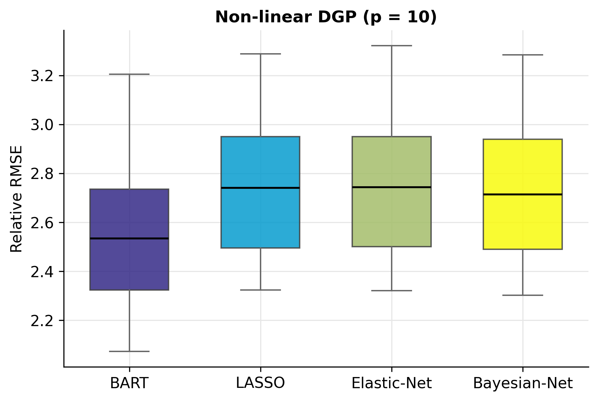
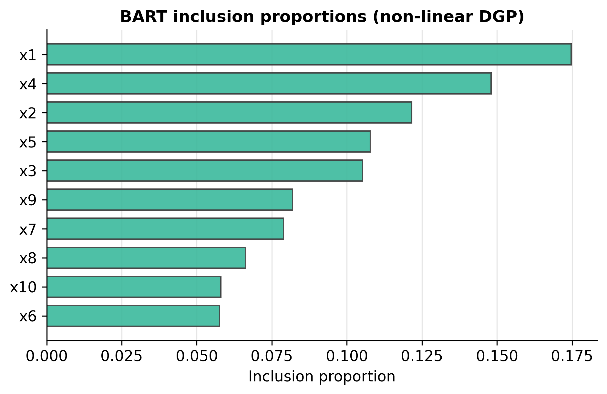
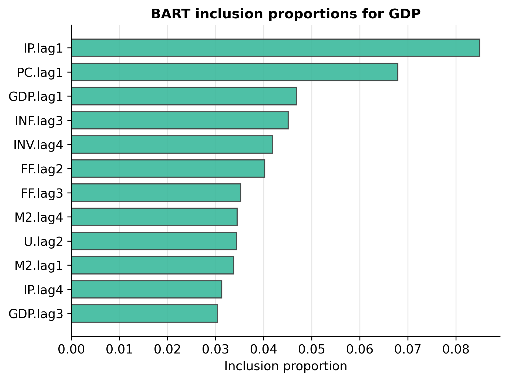
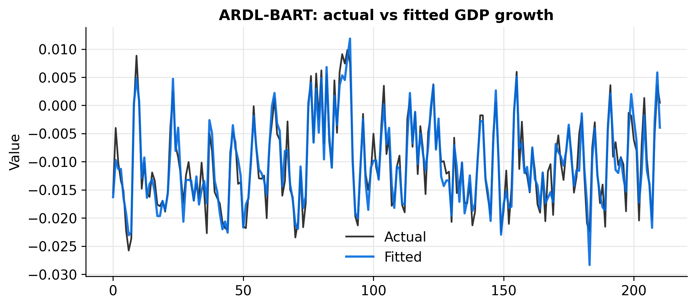

# bartardl

[](https://pypi.org/project/bartardl/)
[](https://pypi.org/project/bartardl/)
[](https://github.com/merwanroudane/bartardl/blob/main/LICENSE)
[](https://doi.org/10.4236/am.2024.154018)

**Non-parametric ARDL modelling with Bayesian Additive Regression Trees (BART).**

📦 **[pypi.org/project/bartardl](https://pypi.org/project/bartardl/)** &nbsp;·&nbsp; `pip install bartardl`

A faithful, self-contained Python implementation of

> Mahdavi, P., Ehsani, M. A., Ahelegbey, D. F. and Mohammadpour, M. (2024).
> *Measuring Causal Effect with ARDL-BART: A Macroeconomic Application.*
> **Applied Mathematics**, 15, 292–312.
> [doi:10.4236/am.2024.154018](https://doi.org/10.4236/am.2024.154018)

`bartardl` fits an **autoregressive distributed lag (ARDL)** model whose
conditional mean is estimated **non-parametrically with BART** instead of OLS,
so it can capture the non-linear and interaction effects the paper argues
dominate macroeconomic data. It benchmarks BART against **LASSO**, **Elastic
Net** and a **Bayesian-Network** (spike-and-slab) selector, and ships
publication-quality figures and tables.

The BART sampler is written from scratch in NumPy — no external BART engine —
so the package installs with only `numpy`, `scipy`, `pandas`, `scikit-learn`
and `matplotlib`.

---

## Highlights

- 🌲 **Faithful BART** — sum-of-trees with the exact priors of Chipman, George
  and McCulloch (2010): tree prior `α(1+d)^(−β)`, conjugate-normal leaves, and
  the `(ν, q)`-calibrated inverse-gamma error prior. Paper defaults
  (`m = 200, k = 2, ν = 3, q = 0.9, α = 0.95, β = 2`) are the library defaults.
- 🔁 **ARDL layer** — one equation per target, every variable entered at lags
  `1…p`, with the paper's Table 3 stationarity transforms built in.
- 🧮 **Competitors as drop-ins** — `Lasso`, `ElasticNet`, `BayesianNetwork`
  share the estimator protocol, so any of them can be the ARDL conditional mean.
- 📊 **Top-journal graphics** — RMSE box plots, variable-inclusion bars with
  95% whiskers, actual-vs-fitted overlays, LaTeX/HTML/console tables, and the
  MATLAB **Parula** palette (`parula_colors`, `turbo_colors`, …).
- 🧪 **Reproduces the paper** — the Friedman simulations and the eight-variable
  US-macro application, with an offline synthetic panel so every example runs
  without a network.

---

## Installation

```bash
pip install bartardl

# optional: live FRED download for the real macro data
pip install "bartardl[fred]"
```

Or from source:

```bash
git clone https://github.com/merwanroudane/bartardl.git
cd bartardl
pip install -e ".[dev]"
```

Requires Python ≥ 3.9.

---

## Quick start

```python
import bartardl as ba

data  = ba.load_macro()                     # stationary US macro panel (8 vars)
model = ba.ARDLBART(                         # ARDL(4) with a BART conditional mean
    n_lags=4,
    estimator=ba.BART,
    estimator_kwargs=dict(n_trees=100, n_burn=500, n_draws=500, random_state=0),
)
res = model.fit(data, target="GDP")

print("In-sample RMSE:", ba.rmse(res.y_train, res.fitted))
print(res.top_features(5))                  # 5 most influential lagged regressors
```

```
In-sample RMSE: 0.0019

  feature variable  lag  importance
  PC.lag1       PC    1    0.0892
  IP.lag1       IP    1    0.0760
 GDP.lag1      GDP    1    0.0601
   U.lag3        U    3    0.0402
 INF.lag3      INF    3    0.0401
```

(this is exactly `python examples/quickstart.py`)

---

## The model

For a target `y` the ARDL-BART equation is

```
y_t = f( y_{t-1}, …, y_{t-p},  x_{1,t-1}, …, x_{k,t-p} ) + e_t ,   e_t ~ N(0, σ²)
```

and `f` is a **sum of `m` regression trees** (BART):

```
f(x) = Σ_{l=1}^{m} g(x ; T_l , M_l)
```

The priors (paper §2) regularise every tree to be a weak learner:

| Component | Prior | Default |
|---|---|---|
| Tree structure | split prob. at depth `d` = `α (1+d)^(−β)` | `α = 0.95`, `β = 2` |
| Leaf value | `μ ~ N(0, τ)`, `τ = (0.5 / (k√m))²` (y scaled to `[−0.5, 0.5]`) | `k = 2` |
| Error variance | `σ² ~ InvGamma(ν/2, νλ/2)`, `λ` from the `q`-quantile rule | `ν = 3`, `q = 0.9` |

The ensemble is drawn by **Bayesian back-fitting MCMC**: each sweep proposes a
single *grow* or *prune* move per tree (Metropolis–Hastings), then re-samples the
leaf values and `σ²`. Variable importance is the **inclusion proportion** — the
share of all splitting rules that use each predictor.

> **Faithfulness notes.** The paper's "ARDL" is the single-equation,
> distributed-lag regression sense (no bounds test / no error-correction term),
> and its "causal effect" framing is operationalised here as forecasting +
> variable importance, exactly as in the paper's own experiments. See
> [`docs/guide.md`](docs/guide.md) for a point-by-point reconciliation with the
> article.

---

## Reproducing the paper

### 1 · Simulations (Tables 1–2, Figures 1–6)

`python examples/01_simulation_linear.py` and
`python examples/02_simulation_nonlinear.py`.

Relative RMSE (RMSE ÷ noise σ; a perfect model scores 1.0), `p = 10`:

**Non-linear DGP — BART wins** (paper Table 2)

| method | mean | median | Q0.50 | Q0.75 |
|---|---|---|---|---|
| **BART** | **2.554** | **2.534** | **2.534** | **2.735** |
| LASSO | 2.750 | 2.741 | 2.741 | 2.951 |
| Elastic-Net | 2.753 | 2.743 | 2.743 | 2.951 |
| Bayesian-Net | 2.727 | 2.714 | 2.714 | 2.939 |

**Linear DGP — the linear selectors win** (paper Table 1)

| method | mean | median | Q0.50 | Q0.75 |
|---|---|---|---|---|
| BART | 1.474 | 1.418 | 1.418 | 1.530 |
| LASSO | 1.033 | 1.023 | 1.023 | 1.080 |
| Elastic-Net | 1.033 | 1.023 | 1.023 | 1.080 |
| **Bayesian-Net** | **1.023** | **1.009** | **1.009** | **1.072** |

<p align="center">
  
  
</p>

### 2 · Empirical application (Table 4, Figure 7)

`python examples/03_macro_forecasting.py` — eight US macro variables,
ARDL(4), hold-out forecast RMSE with per-target ranks:

| target | BART | LASSO | Elastic-Net | Bayesian-Net | best |
|---|---|---|---|---|---|
| GDP | **0.0032** | 0.0057 | 0.0057 | 0.0103 | BART |
| INF | **0.0036** | 0.0037 | 0.0037 | 0.0075 | BART |
| FF  | 0.1216 | **0.0895** | 0.0905 | 0.0937 | LASSO |
| M2  | 0.0035 | **0.0031** | 0.0031 | 0.0076 | LASSO |
| PC  | **0.0039** | 0.0056 | 0.0056 | 0.0091 | BART |
| IP  | **0.0037** | 0.0065 | 0.0065 | 0.0099 | BART |
| U   | **0.1051** | 0.1251 | 0.1252 | 0.1367 | BART |
| INV | **0.0118** | 0.0149 | 0.0149 | 0.0162 | BART |

**BART ranks first for 6 of 8 targets**, with the linear selectors taking the
two (near-)linear series — the same qualitative pattern as the paper's Table 4.

<p align="center">
  
  
</p>

> The bundled panel is a **reproducible synthetic** data set (built so its
> Table-3 transforms carry genuine, economically-motivated non-linearity) so the
> example runs offline. For the real series use
> `ba.load_macro(source="fred")` (needs internet + `pandas-datareader`).

---

## Syntax guide

A complete reference for every public entry point: parameters, defaults, return
types and a runnable snippet for each. Import once as `import bartardl as ba`.

**Contents:** [The estimator protocol](#0--the-estimator-protocol) ·
[Data preparation](#1--data-preparation) · [`ARDLBART`](#2--ardlbart) ·
[`ARDLResult`](#3--ardlresult) · [`BART`](#4--bart) ·
[Competitors](#5--competitors) · [Simulation](#6--simulation) ·
[Metrics & tables](#7--metrics--tables) · [Datasets](#8--datasets) ·
[Visualisation](#9--visualisation) · [Colours](#10--colours) ·
[End-to-end recipes](#11--end-to-end-recipes)

### 0 · The estimator protocol

Every conditional-mean model in the package — `BART`, `Lasso`, `ElasticNet`,
`BayesianNetwork` — implements the same three-part interface, which is why any of
them can be dropped into `ARDLBART(estimator=…)`:

```python
est.fit(X, y)        # X: (n, p) array, y: (n,) array          -> self
est.predict(Xnew)    # Xnew: (m, p) array                       -> (m,) array
est.importance_      # (p,) non-negative weights; BART exposes  inclusion_proportion_
```

To plug in your own model, satisfy those three and pass the class.

---

### 1 · Data preparation

#### `transform_series(x, code) -> np.ndarray`

Apply one FRED-MD stationarity transformation (paper Table 3). Leading values
lost to differencing come back as `NaN`.

| `code` | transform | | `code` | transform |
|:-:|---|---|:-:|---|
| 1 | none | | 4 | `log` |
| 2 | first difference `Δ` | | 5 | first difference of log `Δlog` |
| 3 | second difference `Δ²` | | 6 | second difference of log `Δ²log` |

#### `transform_frame(df, codes) -> pd.DataFrame`

Transform each column by its code (`codes` is a `{column: code}` dict) and drop
the rows lost to differencing.

#### `make_lag_matrix(data, target, n_lags, include_target_lags=True) -> (X, y)`

Build one ARDL equation's design matrix.

| parameter | type | default | meaning |
|---|---|---|---|
| `data` | `DataFrame` | — | stationary multivariate series, one column per variable |
| `target` | `str` | — | column to explain |
| `n_lags` | `int` | — | lags `1…p` of every variable (paper uses 4) |
| `include_target_lags` | `bool` | `True` | include the target's own lags |

Returns `X` (columns named `"<var>.lag<k>"`) and `y` (aligned target). With 8
variables and `n_lags=4` → **32 regressors**.

```python
data = ba.load_macro()
X, y = ba.make_lag_matrix(data, target="GDP", n_lags=4)
X.shape            # (251, 32)
list(X.columns)[:3]   # ['GDP.lag1', 'GDP.lag2', 'GDP.lag3']
```

---

### 2 · `ARDLBART`

```python
ARDLBART(n_lags=4, estimator=BART, include_target_lags=True, estimator_kwargs=None)
```

Single-equation ARDL with a pluggable conditional mean.

| parameter | type | default | meaning |
|---|---|---|---|
| `n_lags` | `int` | `4` | lag order `p` |
| `estimator` | class / instance | `BART` | any model with the [protocol](#0--the-estimator-protocol); a **class** is re-instantiated per fit so each equation is independent |
| `include_target_lags` | `bool` | `True` | pass-through to `make_lag_matrix` |
| `estimator_kwargs` | `dict` | `None` | keyword args forwarded when instantiating `estimator` |

**Methods**

| call | returns | notes |
|---|---|---|
| `.fit(data, target)` | `ARDLResult` | builds the design and fits one equation; also stored on `.result_` |
| `.predict(data, target)` | `pd.Series` | date-indexed predictions using the fitted model |

```python
model = ba.ARDLBART(
    n_lags=4,
    estimator=ba.BART,
    estimator_kwargs=dict(n_trees=200, n_draws=1000, random_state=0),
)
res  = model.fit(data, target="GDP")            # -> ARDLResult
pred = model.predict(data, target="GDP")        # -> pandas Series (aligned to dates)
```

---

### 3 · `ARDLResult`

The object returned by `ARDLBART.fit`.

| attribute | type | meaning |
|---|---|---|
| `.target` | `str` | the modelled variable |
| `.n_lags` | `int` | lag order used |
| `.feature_names` | `list[str]` | the 32 regressor names |
| `.estimator` | object | the fitted conditional-mean model |
| `.fitted` | `ndarray` | in-sample fitted values |
| `.resid` | `ndarray` | in-sample residuals |
| `.y_train` | `ndarray` | the aligned target |
| `.importance` | `ndarray` | per-feature importance / inclusion proportion |

| method | returns | meaning |
|---|---|---|
| `.importance_frame()` | `DataFrame` | tidy, sorted `feature, variable, lag, importance` |
| `.top_features(k=5)` | `DataFrame` | the `k` most important lagged regressors |

```python
res.top_features(5)
res.importance_frame().query("variable == 'M2'")   # all M2 lags
```

---

### 4 · `BART`

```python
BART(config=None, **overrides)          # or BART(n_trees=200, n_draws=1000, …)
```

A self-contained Bayesian Additive Regression Trees regressor. Pass options
either as a `BARTConfig` or directly as keyword arguments.

| parameter | default | meaning |
|---|---|---|
| `n_trees` | `200` | number of trees `m` |
| `k` | `2.0` | leaf-prior width factor (larger ⇒ stronger shrinkage) |
| `nu` | `3.0` | σ² prior degrees of freedom `ν` |
| `q` | `0.90` | σ² prior quantile (prior chance BART beats OLS) |
| `alpha` | `0.95` | tree-prior base `α` in `α(1+d)^(−β)` |
| `beta` | `2.0` | tree-prior depth penalty `β` |
| `n_draws` | `1000` | retained posterior draws |
| `n_burn` | `1000` | burn-in iterations |
| `thin` | `1` | keep every `thin`-th draw |
| `p_grow` | `0.5` | probability a move is *grow* vs *prune* |
| `min_leaf` | `1` | minimum rows per leaf |
| `split_prob` | `None` | length-`p` discrete prior over split variables (paper's relaxation of uniform) |
| `random_state` | `None` | seed |

**Methods & fitted attributes**

| member | returns / type | meaning |
|---|---|---|
| `.fit(X, y)` | `self` | run the back-fitting MCMC |
| `.predict(X)` | `ndarray` | posterior-mean prediction |
| `.predict(X, return_std=True)` | `(ndarray, float)` | prediction and mean σ |
| `.yhat_train_` | `ndarray` | posterior-mean training fit |
| `.yhat_train_draws_` | `ndarray (n_draws, n)` | full posterior of the training fit (for bands) |
| `.sigma_draws_` | `ndarray` | posterior σ draws |
| `.inclusion_proportion_` | `ndarray` | variable importance, sums to 1 |
| `.var_counts_` | `ndarray` | raw split counts per predictor |

```python
m = ba.BART(n_trees=200, k=2.0, nu=3.0, q=0.90,
            alpha=0.95, beta=2.0, random_state=0).fit(X, y)
m.predict(Xnew)
lo, hi = np.percentile(m.yhat_train_draws_, [2.5, 97.5], axis=0)   # 95% band
```

> **Match the paper exactly:** `ba.BART(n_trees=200, k=2, nu=3, q=0.9,
> alpha=0.95, beta=2, n_draws=20000, n_burn=250)`.

---

### 5 · Competitors

All three share the [estimator protocol](#0--the-estimator-protocol) plus a
`.coef_`.

#### `Lasso(cv=5, random_state=None, max_iter=20000)`
Cross-validated L1 regression (Tibshirani, 1996). `.importance_` = `|coef|`
normalised.

#### `ElasticNet(cv=5, l1_ratio=None, random_state=None, max_iter=20000)`
Cross-validated L1/L2 (Zou & Hastie, 2005). `l1_ratio` (the paper's `α`) is a
grid searched by CV; default leans toward the LASSO end.

#### `BayesianNetwork(n_iter=2000, burn=1000, pi=0.5, tau=0.1, c=100.0, random_state=None)`
Spike-and-slab (SSVS) Gibbs sampler. A non-zero coefficient is read as a present
network edge (Ahelegbey–Billio–Casarin, 2016).

| parameter | default | meaning |
|---|---|---|
| `n_iter` / `burn` | `2000` / `1000` | Gibbs iterations / burn-in |
| `pi` | `0.5` | prior inclusion probability |
| `tau` | `0.1` | spike (small-slab) scale |
| `c` | `100.0` | slab-to-spike variance ratio |

Extra attribute: `.inclusion_prob_` (posterior mean of the edge indicators).

```python
for est, kw in [(ba.Lasso, {}), (ba.ElasticNet, {}),
                (ba.BayesianNetwork, dict(n_iter=2000, burn=1000))]:
    r = ba.ARDLBART(n_lags=4, estimator=est, estimator_kwargs=kw).fit(data, "GDP")
    print(est.__name__, ba.rmse(r.y_train, r.fitted))
```

---

### 6 · Simulation

#### `friedman(n=100, p=10, kind="nonlinear", sigma=1.0, random_state=None) -> SimData`

Draw a Friedman (1991) data set; only `x1…x5` are relevant.

| parameter | default | meaning |
|---|---|---|
| `n` | `100` | observations |
| `p` | `10` | predictors (`≥5`; the rest are noise) |
| `kind` | `"nonlinear"` | `"nonlinear"` (Eq. 12) or `"linear"` (Eq. 11) |
| `sigma` | `1.0` | Gaussian noise SD |

`SimData` fields: `.X` `(n,p)`, `.y` `(n,)`, `.f` (noise-free signal),
`.relevant` (`array([0..4])`), `.kind`.

```python
d = ba.friedman(n=200, p=100, kind="nonlinear", sigma=1.0, random_state=0)
m = ba.BART(random_state=0).fit(d.X, d.y)
```

---

### 7 · Metrics & tables

| function | signature | returns |
|---|---|---|
| `rmse` | `rmse(y_true, y_pred)` | `float` |
| `relative_rmse` | `relative_rmse(y_true, y_pred, sigma)` | `float` (RMSE ÷ σ; 1.0 is perfect) |
| `simulation_table` | `simulation_table(rmse_draws, quantiles=(0.50, 0.75))` | `DataFrame` (Tables 1–2) |
| `ranking_table` | `ranking_table(rmse_by_target, ascending=True)` | `DataFrame` (Table 4) |
| `best_method_counts` | `best_method_counts(ranking)` | `Series` (#targets each method wins) |

- `rmse_draws` is `{method: array_of_rmse_per_replication}`.
- `rmse_by_target` is `{target: {method: rmse}}`.

```python
tab = ba.simulation_table({"BART": bart_draws, "LASSO": lasso_draws})
rank = ba.ranking_table({"GDP": {"BART": 0.0032, "LASSO": 0.0057}, ...})
ba.best_method_counts(rank)["BART"]
```

---

### 8 · Datasets

| call | returns | meaning |
|---|---|---|
| `load_macro(source="auto", transform=True, start, end)` | `DataFrame` | the 8-variable panel |
| `fetch_fred_macro(start, end, freq="Q")` | `DataFrame` | live FRED download (needs `pandas-datareader`) |
| `transform_table()` | `DataFrame` | the paper's Table 3 |
| `SERIES` | `list[SeriesSpec]` | short id, FRED code, transform code, description |
| `TRANSFORM_CODES` | `dict` | `{short_id: code}` |

`source` ∈ `{"auto", "bundled", "synthetic", "fred"}`. `transform=True` applies
the Table-3 codes and drops differencing NaNs.

```python
data = ba.load_macro()                    # offline, transformed, ready to model
levels = ba.load_macro(transform=False)   # raw levels
real = ba.load_macro(source="fred")       # live series (pip install bartardl[fred])
ba.transform_table()
```

---

### 9 · Visualisation

`from bartardl import viz` — every function returns a Matplotlib `Axes`.

| function | key parameters | figure |
|---|---|---|
| `rmse_boxplot(rmse_draws, title, ylabel, ax, palette)` | `rmse_draws={method: values}` | Figs 1 / 4 |
| `inclusion_plot(importance, feature_names, ci=None, top=None, title, ax, color_index)` | `ci` = `(p,2)` bounds for 95% whiskers; `top` limits bars | Figs 2 / 7 |
| `forecast_plot(y_true, y_pred, index=None, title, ax)` | actual-vs-fitted overlay | — |
| `journal_table(df, fmt="console", float_format="%.4f", caption, label, bold_min_rows)` | `fmt` ∈ `console`/`latex`/`html` | tables |
| `set_journal_style()` | applies the global theme | — |

```python
from bartardl import viz
ax = viz.rmse_boxplot(rmse_draws, title="Non-linear DGP (p = 10)")
viz.inclusion_plot(res.importance, res.feature_names, top=12,
                   title="BART inclusion proportions for GDP")
print(viz.journal_table(rank, fmt="latex", caption="Table 4"))
```

---

### 10 · Colours

`from bartardl import colors`

| function | returns |
|---|---|
| `parula_colors(n)` | `n` hex stops of MATLAB R2014b **Parula** |
| `matlab_jet_colors(n)` / `turbo_colors(n)` / `bluered_colors(n)` / `sinha_colors(n)` | `n` hex stops of the named palette |
| `get_cmap(name="Parula", n=256)` | a Matplotlib `ListedColormap` |
| `resolve_colorscale(name="Parula", n=256)` | a continuous `LinearSegmentedColormap` |

```python
from bartardl.colors import parula_colors, get_cmap
parula_colors(8)                 # ['#352a87', '#0268e1', …]
plt.imshow(Z, cmap=get_cmap("Parula"))
```

<p align="center"></p>

---

### 11 · End-to-end recipes

**Compare all four estimators on one target and rank them**

```python
import bartardl as ba
data = ba.load_macro(); H = 40; train = data.iloc[:-H]
methods = {
    "BART":         (ba.BART,            dict(n_trees=200, n_draws=1000, random_state=0)),
    "LASSO":        (ba.Lasso,           {}),
    "Elastic-Net":  (ba.ElasticNet,      {}),
    "Bayesian-Net": (ba.BayesianNetwork, dict(n_iter=2000, burn=1000, random_state=0)),
}
rmse_by_target = {}
for tgt in data.columns:
    rmse_by_target[tgt] = {}
    for name, (est, kw) in methods.items():
        m = ba.ARDLBART(n_lags=4, estimator=est, estimator_kwargs=kw).fit(train, tgt)
        pred = m.predict(data, tgt).iloc[-H:]
        rmse_by_target[tgt][name] = ba.rmse(data[tgt].loc[pred.index], pred)
print(ba.ranking_table(rmse_by_target))
```

**Run the non-linear Monte-Carlo and summarise (Table 2)**

```python
draws = {"BART": [], "LASSO": []}
for rep in range(100):
    tr = ba.friedman(n=100, p=10, kind="nonlinear", random_state=rep)
    te = ba.friedman(n=100, p=10, kind="nonlinear", random_state=1000 + rep)
    for name, est in [("BART", ba.BART(random_state=0)), ("LASSO", ba.Lasso())]:
        est.fit(tr.X, tr.y)
        draws[name].append(ba.relative_rmse(te.y, est.predict(te.X), 1.0))
print(ba.simulation_table(draws))
```

---

## Documentation

- **[`docs/guide.md`](docs/guide.md)** — a detailed, from-the-ground-up guide to
  *how the code is written*: the BART sampler internals (grow/prune acceptance
  ratios, back-fitting, σ calibration), the ARDL design, how the competitors and
  the SSVS sampler work, how to extend the package, and a full reconciliation
  with the paper.
- **[`examples/`](examples)** — runnable scripts for the quick start, both
  simulations, and the macro application.
- **`docs/make_figures.py`** — regenerates every figure and table in this README.

---

## Testing

```bash
pip install -e ".[dev]"
pytest -q
```

---

## Citing

If you use this software, please cite the paper and the package:

```bibtex
@article{mahdavi2024ardlbart,
  author  = {Mahdavi, Pegah and Ehsani, Mohammad Ali and
             Ahelegbey, Daniel Felix and Mohammadpour, Mehrnaz},
  title   = {Measuring Causal Effect with {ARDL-BART}: A Macroeconomic Application},
  journal = {Applied Mathematics},
  year    = {2024},
  volume  = {15},
  pages   = {292--312},
  doi     = {10.4236/am.2024.154018}
}

@software{roudane_bartardl,
  author = {Merwan Roudane},
  title  = {bartardl: Non-parametric ARDL modelling with BART},
  url    = {https://github.com/merwanroudane/bartardl}
}
```

## License

MIT © Merwan Roudane. See [LICENSE](LICENSE).
